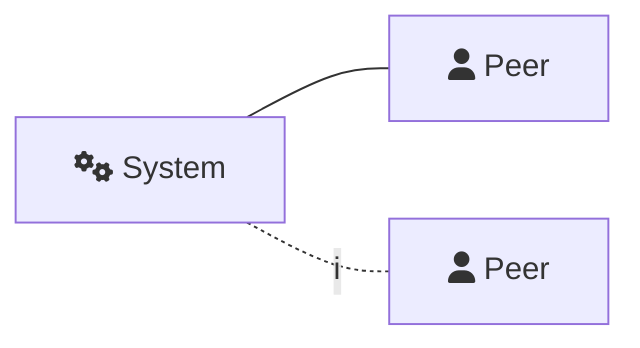
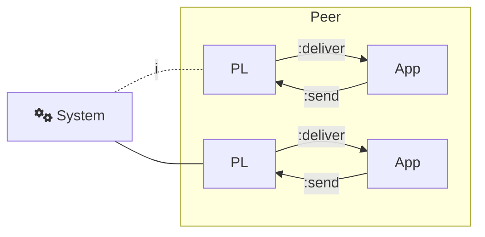
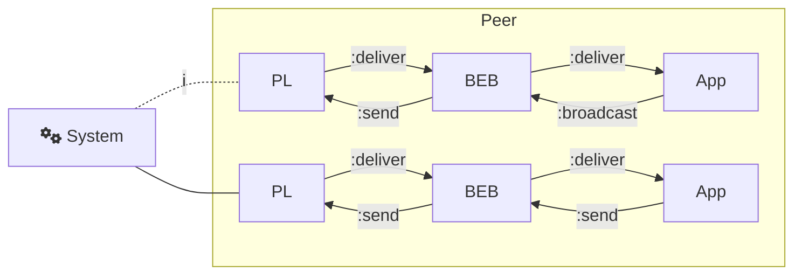
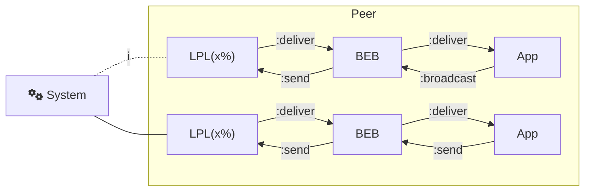
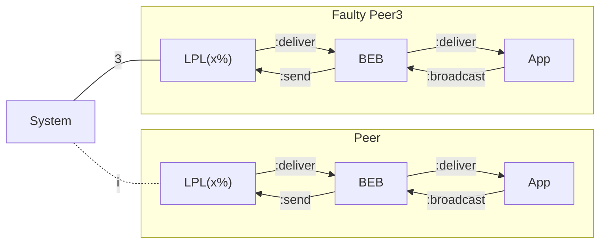
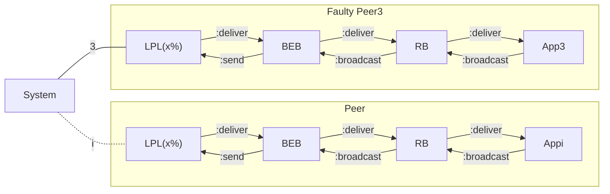

# Distributed Algorithms 347

## Coursework 1

#### Thibault Meunier (ttm17)

### Introduction

#### Setup

All code mentioned in the current paper were run with the following configuration

| Computer       | Xiaomi Notebook Air  |
| -------------- | -------------------- |
| Processor      | Intel Core 2.3GHz x4 |
| OS             | Debian Buster64-bit  |
| Memory         | 7.7 GiB              |
| Elixir         | 1.3.3                |
| Docker         | 17.12.0-ce           |
| Docker-compose | 1.17.1               |

#### System architecture

The system under test is composed of `N = 5` fully connected peers. Each peer broadcast `max_messages` or until a `timeout` is reach.

I've set a priority on listening. Then if a peer has messages in its mailbox, it will first process them and pursue its broadcasting later on.

#### Tests

Tests are run locally and on a Docker network with 1 container for each peer. I ran the following requests:

1. `{:broadcast, 1000, 3000}`
2. `{:broadcast, 10_000_000, 3000}`

The output of tests are formatted as follow:

```elixir
<PeerPID>: {number_of_messages_sent_to_peer_i, number_of_messages_received_from_peer_i}*
```

The order doesn't matter since the system is not deterministic. On top of that, `number_of_messages_sent_to_peer_i` is constant because the peer has no method to determine if the message has been received properly. I have addressed this issue in the last part of the report. If not stated, assume `number_of_messages_sent_to_peer_i` to be the broadcast count the peer.

### System1 - Elixir Broadcast

#### Introduction

System1 is a basic system where peer communicate directly with each other.



#### Local

+ `{:broadcast, 1000, 3000}`

  ```python
  <0.101.0>: {1000, 1000}{1000, 1000}{1000, 1000}{1000, 1000}{1000, 1000}
  <0.102.0>: {1000, 1000}{1000, 1000}{1000, 1000}{1000, 1000}{1000, 1000}
  <0.99.0>: {1000, 1000}{1000, 1000}{1000, 1000}{1000, 1000}{1000, 1000}
  <0.98.0>: {1000, 1000}{1000, 1000}{1000, 1000}{1000, 1000}{1000, 1000}
  <0.100.0>: {1000, 1000}{1000, 1000}{1000, 1000}{1000, 1000}{1000, 1000}
  ```

  All messages where sent and all messages where received. The load is low, it seems decent.


+ `{:broadcast, 10_000_000, 3000}`

  ```python
  <0.98.0>: {302064, 302064}{302064, 264047}{302064, 116376}{302064, 245874}{302064, 356553}
  <0.102.0>: {356553, 302064}{356553, 264047}{356553, 116376}{356553, 245874}{356553, 356553}
  <0.99.0>: {264047, 302064}{264047, 264047}{264047, 116376}{264047, 245874}{264047, 356553}
  <0.101.0>: {245874, 302064}{245874, 264047}{245874, 116376}{245874, 245874}{245874, 356553}
  <0.100.0>: {116376, 302064}{116376, 264047}{116376, 116376}{116376, 245874}{116376, 356553}
  ```

  Out of `10_000_000` messages, only `300_000` where broadcasted on average. It means the timeout was triggered. The link used by elixir looks reliable enough, all sent messages were received.

  On top of that, one can notice some peers sent less messages than others. It is due to the listen-first policy. Peers that receive less messages are able to send more, slowing already loaded peers in the process.

#### Docker

+ `{:broadcast, 1000, 3000}`

  ```python
  <0.145.0>: {1000, 1000}{1000, 1000}{1000, 1000}{1000, 1000}{1000, 1000}
  <0.145.0>: {1000, 1000}{1000, 1000}{1000, 1000}{1000, 1000}{1000, 1000}
  <0.147.0>: {1000, 1000}{1000, 1000}{1000, 1000}{1000, 1000}{1000, 1000}
  <0.129.0>: {1000, 1000}{1000, 1000}{1000, 1000}{1000, 1000}{1000, 1000}
  <0.128.0>: {1000, 1000}{1000, 1000}{1000, 1000}{1000, 1000}{1000, 1000}
  ```

  This example behaves as before. Latency induce by the use of a docker network is not important enough for the number of messages.

+ `{:broadcast, 10_000_000, 3000}`

  ```python
  <0.109.0>: {32106, 61171}{32106, 32106}{32106, 22583}{32106, 17831}{32106, 57272}
  <0.98.0>: {61171, 61171}{61171, 32106}{61171, 22583}{61171, 17831}{61171, 57272}
  <0.109.0>: {57272, 61171}{57272, 32106}{57272, 22583}{57272, 17831}{57272, 57272}
  <0.109.0>: {17831, 61171}{17831, 32106}{17831, 22583}{17831, 17831}{17831, 57272}
  <0.109.0>: {22583, 61171}{22583, 32106}{22583, 22583}{22583, 17831}{22583, 57272}
  ```

  The number of sent messages on the docker network is strictly less than locally. The difference is around 1 order of magnitude. It is the consequence of the latency the network has.

### System2 - PL Broadcast

#### Introduction

System2 takes System1 and divide `Peer` process in two sub-component. Peers are bind together by their Perfect Link `PL`. It forward `:deliver` request to the `App` and send `:send` request to the matching peer.



The code structure has also been improved, moving from two distinct functions to start the system to only one which is parameterised. Moreover, if the system is not able to retrieve the `PL` of every `Peer`, it won't start.

Like computer are identified by their MAC address, peers are identified by their PL process id. It is for the sake of simplicity and has changed in future systems.

#### Local

- `{:broadcast, 1000, 3000}`

  ```python
  <0.105.0>: {1000, 1000}{1000, 1000}{1000, 1000}{1000, 1000}{1000, 1000}
  <0.109.0>: {1000, 1000}{1000, 1000}{1000, 1000}{1000, 1000}{1000, 1000}
  <0.107.0>: {1000, 1000}{1000, 1000}{1000, 1000}{1000, 1000}{1000, 1000}
  <0.103.0>: {1000, 1000}{1000, 1000}{1000, 1000}{1000, 1000}{1000, 1000}
  <0.111.0>: {1000, 1000}{1000, 1000}{1000, 1000}{1000, 1000}{1000, 1000}
  ```

  All good. Not much messages and only a refactoring has been made.


- `{:broadcast, 10_000_000, 3000}`

  ```python
  <0.105.0>: {113513, 111312}{113513, 113513}{113513, 143589}{113513, 91379}{113513, 114196}
  <0.111.0>: {114196, 111312}{114196, 113513}{114196, 143589}{114196, 91379}{114196, 114196}
  <0.103.0>: {111312, 111312}{111312, 113513}{111312, 143589}{111312, 91379}{111312, 114196}
  <0.109.0>: {91379, 111312}{91379, 113513}{91379, 143589}{91379, 91379}{91379, 114196}
  <0.107.0>: {143589, 111312}{143589, 113513}{143589, 143589}{143589, 91379}{143589, 114196}
  ```

  A bit less sent messages than System1. `App` is not receiving all messages directly. A delay can occur when `App` and `Peer` are communicating with each other.

#### Docker

- `{:broadcast, 1000, 3000}`

  ```python
  <0.157.0>: {1000, 1000}{1000, 1000}{1000, 1000}{1000, 1000}{1000, 1000}
  <0.99.0>: {1000, 1000}{1000, 1000}{1000, 1000}{1000, 1000}{1000, 1000}
  <0.99.0>: {1000, 1000}{1000, 1000}{1000, 1000}{1000, 1000}{1000, 1000}
  <0.99.0>: {1000, 1000}{1000, 1000}{1000, 1000}{1000, 1000}{1000, 1000}
  <0.110.0>: {1000, 1000}{1000, 1000}{1000, 1000}{1000, 1000}{1000, 1000}
  ```

  System2 is similar to System1 and it seems to handle low load on docker network.


- `{:broadcast, 10_000_000, 3000}`

  ```python
  <0.110.0>: {65978, 75241}{65978, 81137}{65978, 65978}{65978, 63389}{65978, 83485}
  <0.110.0>: {81137, 75241}{81137, 81137}{81137, 65978}{81137, 63389}{81137, 83485}
  <0.110.0>: {63389, 75241}{63389, 81137}{63389, 65978}{63389, 63389}{63389, 83485}
  <0.99.0>: {75241, 75241}{75241, 81137}{75241, 65978}{75241, 63389}{75241, 83485}
  <0.110.0>: {83485, 75241}{83485, 81137}{83485, 65978}{83485, 63389}{83485, 83485}
  ```

  ​

### System3 - Best Effort Broadcast

#### Introduction

System3 takes System2 and add a dedicated component to broadcast: `BEB`. The purpose of `BEB` is to broadcast incoming messages to all peers.



#### Local

- `{:broadcast, 1000, 3000}`

  ```python
  <0.112.0>: {1000, 1000}{1000, 1000}{1000, 1000}{1000, 1000}{1000, 1000}
  <0.106.0>: {1000, 1000}{1000, 1000}{1000, 1000}{1000, 1000}{1000, 1000}
  <0.103.0>: {1000, 1000}{1000, 1000}{1000, 1000}{1000, 1000}{1000, 1000}
  <0.109.0>: {1000, 1000}{1000, 1000}{1000, 1000}{1000, 1000}{1000, 1000}
  <0.115.0>: {1000, 1000}{1000, 1000}{1000, 1000}{1000, 1000}{1000, 1000}
  ```

  System works as expected.


- `{:broadcast, 10_000_000, 3000}`

  ```python
  <0.103.0>: {273160, 273160}{273160, 262502}{273160, 259035}{273160, 422097}{273160, 293179}
  <0.115.0>: {293179, 273160}{293179, 262502}{293179, 259035}{293179, 422097}{293179, 293179}
  <0.106.0>: {262502, 273160}{262502, 262502}{262502, 259035}{262502, 422097}{262502, 293179}
  <0.109.0>: {259035, 273160}{259035, 262502}{259035, 259035}{259035, 422097}{259035, 293179}
  <0.112.0>: {422097, 273160}{422097, 262502}{422097, 259035}{422097, 422097}{422097, 293179}
  ```

  This system achieves better performances than System1. It is impressive. I suspect it is due to the split between processing messages and sending them. Before, the same component (`App`) processed both incoming messages and loop to send new ones. Now, sending is done in parallel by `BEB` which leaves `App` free to do its job.

#### Docker

- `{:broadcast, 1000, 3000}`

  ```python
  <0.98.0>: {1000, 1000}{1000, 1000}{1000, 1000}{1000, 1000}{1000, 1000}
  <0.102.0>: {1000, 1000}{1000, 1000}{1000, 1000}{1000, 1000}{1000, 1000}
  <0.100.0>: {1000, 1000}{1000, 1000}{1000, 1000}{1000, 1000}{1000, 1000}
  <0.101.0>: {1000, 1000}{1000, 1000}{1000, 1000}{1000, 1000}{1000, 1000}
  <0.103.0>: {1000, 1000}{1000, 1000}{1000, 1000}{1000, 1000}{1000, 1000}
  ```

  On low load, `BEB` has no problem to send all messages.


- `{:broadcast, 10_000_000, 3000}`

  ```python
  <0.110.0>: {194135, 179018}{194135, 181317}{194135, 172231}{194135, 192240}{194135, 194135}
  <0.110.0>: {179018, 179018}{179018, 181317}{179018, 172231}{179018, 192240}{179018, 194135}
  <0.110.0>: {172231, 179018}{172231, 181317}{172231, 172231}{172231, 192240}{172231, 194135}
  <0.110.0>: {192240, 179018}{192240, 181317}{192240, 172231}{192240, 192240}{192240, 194135}
  <0.110.0>: {181317, 179018}{181317, 181317}{181317, 172231}{181317, 192240}{181317, 194135}

  ```

  All sent messages are received. It works better than on System2 from the same reason as the local version.

### System4 - Unreliable Message Sending

#### Introduction

System4 replaces Perfect Link `PL` we had on System3 by a Loosy P2P Link `LPL`.  This new link sends messages with a certain probability `p`. To specify p, you can edit `lib/pl.ex` where you will find a `reliability` variable in `start()` function.



#### Tests

Because `LPL` behaves the same locally and on a Docker network, I decided to stick to local testing. There is no point on querying the system with million messages. I ran `{:broadcast, 1000, 3000}` to better illustrate the unreliable behaviour of `LPL`.

- `p = 100%`

  ```python
  <0.115.0>: {1000, 1000}{1000, 1000}{1000, 1000}{1000, 1000}{1000, 1000}
  <0.106.0>: {1000, 1000}{1000, 1000}{1000, 1000}{1000, 1000}{1000, 1000}
  <0.112.0>: {1000, 1000}{1000, 1000}{1000, 1000}{1000, 1000}{1000, 1000}
  <0.109.0>: {1000, 1000}{1000, 1000}{1000, 1000}{1000, 1000}{1000, 1000}
  <0.103.0>: {1000, 1000}{1000, 1000}{1000, 1000}{1000, 1000}{1000, 1000}
  ```

  With `p = 100%`, `LPL` is a `PL`. Then it behaves the same.


- `p = 0%`

  ```python
  <0.112.0>: {1000, 0}{1000, 0}{1000, 0}{1000, 0}{1000, 0}
  <0.109.0>: {1000, 0}{1000, 0}{1000, 0}{1000, 0}{1000, 0}
  <0.103.0>: {1000, 0}{1000, 0}{1000, 0}{1000, 0}{1000, 0}
  <0.106.0>: {1000, 0}{1000, 0}{1000, 0}{1000, 0}{1000, 0}
  <0.115.0>: {1000, 0}{1000, 0}{1000, 0}{1000, 0}{1000, 0}
  ```

  With `p = 0%`, `LPL` throws every outgoing message. Then no `App` component is able to retrieve messages. We notice `App` believes its messages where sent, since there is no acknowledgement procedure.


- `p = 20%`

  ```python
  <0.106.0>: {1000, 201}{1000, 203}{1000, 186}{1000, 206}{1000, 200}
  <0.112.0>: {1000, 172}{1000, 211}{1000, 181}{1000, 183}{1000, 207}
  <0.103.0>: {1000, 184}{1000, 196}{1000, 182}{1000, 197}{1000, 195}
  <0.115.0>: {1000, 210}{1000, 210}{1000, 212}{1000, 188}{1000, 204}
  <0.109.0>: {1000, 206}{1000, 219}{1000, 190}{1000, 206}{1000, 181}
  ```

  `App` receives about `200` messages out of `1000` sent. It is coherent regarding that `p = 20%`.

### System5 - Faulty Process

#### Introduction

System5 is based on System4 with `p = 50%` for `LPL`. After `5ms`, it kills `Peer3`.



The only requirement is to test how the system behaves when Peer3 fails. Because its failure happens early in the broadcasting procedures, there is no need to test System5 with `10_000_000` messages.

#### Local

- `{:broadcast, 1000, 3000}`

  ```python
  <0.103.0>: {1000, 478}{1000, 493}{1000, 523}{1000, 0}{1000, 514}
  <0.115.0>: {1000, 495}{1000, 497}{1000, 479}{1000, 0}{1000, 533}
  <0.106.0>: {1000, 487}{1000, 488}{1000, 512}{1000, 0}{1000, 488}
  <0.109.0>: {1000, 477}{1000, 500}{1000, 490}{1000, 0}{1000, 518}
  ```

  The output is only 4 lines long because `Peer3` is faulty. There is also no messages receive from it, as `{1000, 0}` denotes. However, every `Peer` tried to send messages to it.

#### Docker

- `{:broadcast, 1000, 3000}`

  ```python
  <0.161.0>: {1000, 489}{1000, 479}{1000, 0}{1000, 472}{1000, 508}
  <0.161.0>: {1000, 472}{1000, 488}{1000, 0}{1000, 450}{1000, 499}
  <0.148.0>: {1000, 491}{1000, 479}{1000, 0}{1000, 496}{1000, 520}
  <0.148.0>: {1000, 506}{1000, 506}{1000, 0}{1000, 518}{1000, 523}
  ```

  We notice no change in behaviour. The output is similar to the one we get on the local version.

### System6 - Eager Reliable Broadcast

#### Introduction

System6 lies on System5. It tries to fix it using reliable broadcast mechanism. This is the aim of `RB` component. When it receives an unseen message, it broadcast it again to other peers. Therefore even if `PL` is faulty, the message has an increasing probability to reach all peers.



#### Local

- `{:broadcast, 1000, 3000}`

  ```python
  <0.111.0>: {1000, 845}{1000, 860}{1000, 836}{1000, 0}{1000, 855}
  <0.103.0>: {1000, 851}{1000, 849}{1000, 843}{1000, 0}{1000, 853}
  <0.119.0>: {1000, 869}{1000, 861}{1000, 830}{1000, 0}{1000, 847}
  <0.107.0>: {1000, 865}{1000, 864}{1000, 847}{1000, 0}{1000, 853}
  ```

  Before the fix, there was `50%` chance to receive a message. With this new technique, it goes up to `85%`. What is important to notice is the fact those results are much better with more peers. With a 10-peer system, messages are received nearly `100%` of the time.

  **Calculous here**


- `{:broadcast, 10_000_000, 3000}`

  ```python
  <0.107.0>: {333764, 283499}{333764, 284980}{333764, 175111}{333764, 2}{333764, 213906}
  <0.103.0>: {331751, 283352}{331751, 285275}{331751, 174916}{331751, 3}{331751, 213818}
  <0.119.0>: {250445, 283263}{250445, 285142}{250445, 175021}{250445, 3}{250445, 213856}
  <0.111.0>: {205308, 283230}{205308, 284818}{205308, 175209}{205308, 3}{205308, 213784}
  ```

  Results are similar to the one we have with `1000` messages. Messages are received with `85%` chance.

  To get this probability, I identify the node that sent the less messages and link it to the node from which less messages have been received. It points to $p=\frac{205300}{175000}\approx0.85$

#### Docker

- `{:broadcast, 1000, 3000}`

  ```python
  <0.129.0>: {1000, 838}{1000, 855}{1000, 861}{1000, 839}{1000, 0}
  <0.129.0>: {1000, 835}{1000, 854}{1000, 859}{1000, 849}{1000, 0}
  <0.166.0>: {1000, 857}{1000, 865}{1000, 866}{1000, 838}{1000, 0}
  <0.166.0>: {1000, 848}{1000, 853}{1000, 865}{1000, 825}{1000, 0}
  ```

  `1000` messages is not enough to stress the system. Then the output on docker network looks similar to the one on local network `p = 85%`.


- `{:broadcast, 10_000_000, 3000}`

  ```python
  <0.110.0>: {195627, 173873}{195627, 124663}{195627, 166975}{195627, 0}{195627, 143790}
  <0.110.0>: {168656, 174247}{168656, 124971}{168656, 167000}{168656, 0}{168656, 144044}
  <0.110.0>: {203850, 174036}{203850, 124898}{203850, 167010}{203850, 0}{203850, 144030}
  <0.110.0>: {146149, 174057}{146149, 124906}{146149, 167040}{146149, 0}{146149, 143847}
  ```

  Same again. `p = 85%`.

### 